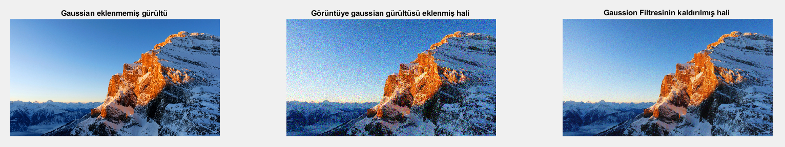

Lineer Gürültü Yumuşatma

Lineer gürültü yumuşatma filtreleri gauss, tuz & biber gibi belirli tip gürültüleri azaltmak için kullanılırlar. 

Gauss filtresi, medyan filtresi, ortalama filtresi gibi filtreler lineer gürültü yumuşatma için kullanılırlar. Bu projede temiz bir görüntüye gauss gürültüsü eklenmiş, daha sonra bu gürültü gauss filtresi ile temizlenmiştir.

